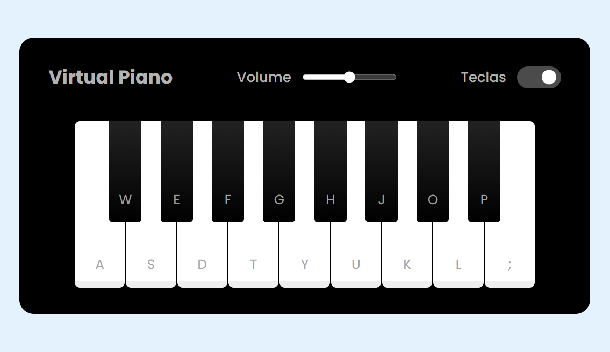

<h1 align="center">Piano Virtual</h1>

<h2>Descrição:</h2>

Neste projeto foi abordado a manipulação do DOM,possibilitando atribuir um som para cada tecla do piano,ajustar o volume, ocultar as letras das teclas e inserir uma classe dinamicamente em um elemento.

<h2>Tecnologias Utilizadas:</h2>

